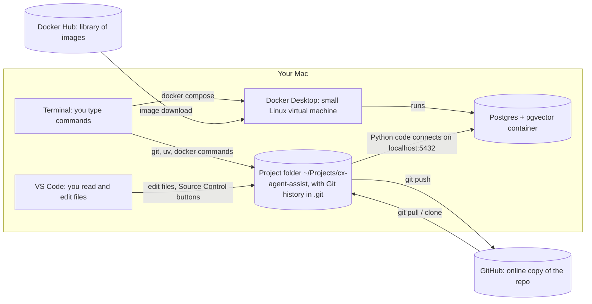
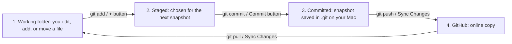
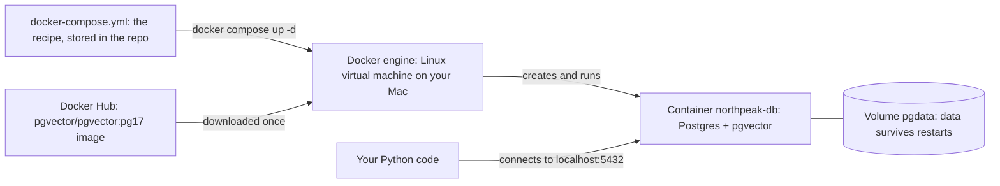

# Setup Guide: cx-agent-assist

A living record of every setup step for this project: **what you run, what is actually happening, and how to check it worked.**
Update this file whenever a step is added or changed, then commit it.

| Situation | Start at |
|---|---|
| Want to understand how the tools fit together | Section 0 |
| New computer | Section 1 |
| New project on this Mac | Section 3 |
| Starting a work session | Section 4 |
| Saving work | Section 5 |
| Adding a file Claude made | Section 6 |

Status key in headings: ✅ done · ⬜ not yet · ➖ optional / skipped

---

## 0. How the pieces fit together

The **project folder** on your Mac is the center of everything. Terminal and VS Code are two different ways to work on that same folder (and in practice you'll use the terminal built into VS Code). Git records the folder's history, GitHub keeps an online copy of that history, and Docker runs the database your code talks to.



| Tool | What it is | Where it lives | Its job in this project |
|---|---|---|---|
| **Terminal** | A text window for giving your Mac commands. The program inside it that reads your commands is called the *shell* (zsh on a Mac) | Your Mac | Runs everything: git, uv, docker, gh |
| **VS Code** | A code editor | Your Mac | Reading and editing files. It also has a built-in terminal (**Control + `**) and Git buttons, which run the same commands as Terminal |
| **Project folder** | The actual files of your project | `~/Projects/cx-agent-assist` | The thing all the other tools work on |
| **Git** | Version-control software that saves snapshots (*commits*) of the folder | Your Mac, history stored in the hidden `.git` folder | Records every change so you can see history and undo mistakes |
| **GitHub** | A website that hosts copies of Git repositories | github.com | Your online backup and public portfolio. Synced with `git push` and `git pull` |
| **gh** | GitHub's command-line tool | Your Mac | Signing in, creating repos, pull requests, without the website |
| **Docker Desktop** | An app that runs *containers*: isolated, pre-packaged software | Your Mac (inside a small Linux virtual machine) | Runs the Postgres database so you don't install it directly on your Mac |
| **Docker Hub** | A website of ready-made container *images* | hub.docker.com | Where the `pgvector/pgvector` image downloads from. No account needed |
| **uv** | Python version and package manager | Your Mac | Installs Python and libraries (pandas, LangChain) for this project only |

### Key distinctions

| Often confused | Difference |
|---|---|
| Git vs. GitHub | Git is the tool on your Mac that saves history. GitHub is a website that stores a copy. Git works fine without GitHub |
| Commit vs. push | A commit saves a snapshot on your Mac only. A push uploads your commits to GitHub |
| Terminal vs. VS Code terminal | Same shell, same commands, same results. VS Code's is just a panel inside the editor |
| Image vs. container | An image is a packaged program (like an installer). A container is a running copy of it |
| `gh` sign-in vs. VS Code sign-in | `gh` lets Git push and pull. VS Code's sign-in is for editor features (Settings Sync). They are separate |

### Your workspace: VS Code

You work in one VS Code window. The terminal inside it is the same zsh shell as the Mac Terminal app, and it opens already inside the project folder.

```text
┌───────────────────┬───────────────────────────────────────────────┐
│ Activity bar      │  EDITOR                                        │
│  📄 Explorer      │  The file you're editing, e.g. docs/SETUP.md   │
│  ⑂ Source Control │  Cmd+Shift+V = formatted preview of Markdown   │
│                   │                                                │
│ SIDEBAR           ├───────────────────────────────────────────────┤
│  file list, or    │  TERMINAL  (Control + `)                       │
│  changed files    │  markaguilar@... cx-agent-assist %             │
├───────────────────┴───────────────────────────────────────────────┤
│ STATUS BAR:  ⑂ main   ↑0 ↓0 (sync)   account                       │
└───────────────────────────────────────────────────────────────────┘
```

| Area | How to get there | What you use it for |
|---|---|---|
| Explorer | Top icon in the left activity bar (**Cmd + Shift + E**) | Browse and open files |
| Source Control | Branch icon in the activity bar (**Control + Shift + G**) | See what changed, stage, commit, sync with GitHub |
| Editor | Center | Read and edit files. Markdown preview: **Cmd + Shift + V** |
| Terminal | **Control + `** or View → Terminal | Run commands: git, uv, docker |
| Status bar | Bottom edge | Current branch (`main`) and how many commits are waiting to push (↑) or pull (↓) |

### The life of a change

Every file change goes through the same four stages. VS Code buttons and terminal commands do exactly the same thing at each step.



| Stage | What it means | How to see it |
|---|---|---|
| 1. Working folder | The file changed on your Mac, and Git noticed | `git status` shows it in red, or VS Code lists it under **Changes** |
| 2. Staged | You chose to include it in the next snapshot | `git status` shows it in green, or under **Staged Changes** |
| 3. Committed | Saved in local history. Not online yet | `git log --oneline` shows it at the top. Status bar shows ↑1 |
| 4. Pushed | On GitHub | Visible on github.com. Status bar shows ↑0 |

### How Docker runs the database



| Piece | What it is |
|---|---|
| Image | The packaged software, downloaded once, like an installer |
| Container | A running copy of the image. Can be stopped and started |
| Volume | Storage for the database's data, kept separate so it survives the container stopping or being recreated |
| Port 5432 | The door Postgres listens on. The Compose file connects your Mac's 5432 to the container's, so your code can reach it at `localhost:5432` |

### Terminal basics used in this guide

| Symbol | Meaning | Example |
|---|---|---|
| `~` | Your home folder, `/Users/markaguilar` | `cd ~/Projects` |
| `cd` | Change directory (move into a folder) | `cd cx-agent-assist` |
| PATH | The list of folders the shell searches when you type a command name. "command not found" usually means the program's folder isn't on PATH | Homebrew's "Next steps" add `/opt/homebrew/bin` to PATH |
| `&&` | Run the next command only if the previous one succeeded | `mkdir -p x && cd x` |
| `\|\|` | Run the next command only if the previous one failed | `test \|\| echo "failed"` |
| `\|` (pipe) | Send one command's output into another command | `code --version \| head -1` |
| `$( ... )` | Run the command inside and use its output in place | `echo "$(git config user.email)"` |
| `> /dev/null 2>&1` | Throw away a command's normal output and error messages (used in scripts to keep output tidy) | `docker info >/dev/null 2>&1` |
| `\` at end of line | The command continues on the next line | Long `gh repo create` commands |
| `#` | A comment. The shell ignores everything after it | `# explanation` |

---

## 1. Once per computer

### ✅ Apple developer tools
```bash
xcode-select --install
```
**What's happening:** Installs Apple's Command Line Tools: Git, compilers, and other basics that developer tools depend on. Homebrew won't install without them.
**Verify:** `git --version`

### ✅ Homebrew
```bash
/bin/bash -c "$(curl -fsSL https://raw.githubusercontent.com/Homebrew/install/HEAD/install.sh)"
# then the "Next steps" lines it prints:
echo >> ~/.zprofile
echo 'eval "$(/opt/homebrew/bin/brew shellenv zsh)"' >> ~/.zprofile
eval "$(/opt/homebrew/bin/brew shellenv zsh)"
```
**What's happening:** `curl` downloads Homebrew's install script and `bash` runs it. Homebrew installs itself in `/opt/homebrew` (the Apple silicon location). The "Next steps" lines append a line to `~/.zprofile`, a settings file zsh reads every time you open Terminal. That line adds `/opt/homebrew/bin` to your PATH, which is why `brew` was "not found" until you ran them. The last `eval` applies it to the current window without restarting Terminal.
**Verify:** `brew --version`

### ✅ Rosetta
```bash
softwareupdate --install-rosetta --agree-to-license
```
**What's happening:** Rosetta is Apple's translator that lets programs built for Intel Macs run on Apple silicon. Docker offers it for Intel-only container images. This project doesn't need it (our images have native Apple silicon versions), but installing it ahead of time avoids the error Docker hit trying to install it itself.
**Verify:** Prints "Install of Rosetta 2 finished successfully"

### ✅ GitHub CLI and uv
```bash
brew install gh uv
```
**What's happening:** Homebrew downloads ready-built versions of both programs into `/opt/homebrew/bin`, which is on your PATH, so you can type `gh` and `uv` from any folder.
**Verify:** `gh --version` and `uv --version`

### ✅ VS Code and Docker Desktop
```bash
brew install --cask visual-studio-code docker-desktop
```
**What's happening:** `--cask` means full Mac apps with windows, which go into `/Applications`. VS Code also installs the `code` terminal command, so `code .` opens the current folder in the editor.
**Verify:** `code --version` and `docker --version`

### ✅ Docker first run
```bash
open -a Docker
# Accept terms → Use recommended settings → Skip sign-in
docker run --rm hello-world
```
**What's happening:** Containers need a Linux system, and macOS isn't Linux. So on first run, Docker Desktop builds a small Linux virtual machine on your Mac, called the *engine*. The `docker` command in Terminal talks to that engine through a connection file (`~/.docker/run/docker.sock`). When you saw "failed to connect to the docker API," the engine wasn't running, so that file didn't exist. `hello-world` downloads a tiny test image from Docker Hub, runs it once, and `--rm` deletes the container afterward.
**Verify:** Prints "Hello from Docker!"

### ✅ GitHub sign-in (terminal)
```bash
gh auth login
# GitHub.com → HTTPS → Yes → Login with a web browser
```
**What's happening:** GitHub gives `gh` an access token (the `gho_...` value you saw), stored securely in your Mac's Keychain. "Authenticate Git with your GitHub credentials: Yes" tells Git to ask `gh` for that token whenever it pushes or pulls, so you never type a password.
**Verify:** `gh auth status`

### ✅ Git identity
```bash
git config --global user.name "Mark Aguilar"
git config --global user.email "$(gh api user --jq '"\(.id)+\(.login)@users.noreply.github.com"')"
git config --global init.defaultBranch main
```
**What's happening:** `--global` writes settings to `~/.gitconfig`, which applies to every repo on this Mac. Your name and email are stamped on every commit you make. The email line uses `$( ... )` to ask GitHub for your account ID and username, then builds your private noreply address from them, so your real email never appears in public commits. The last line makes new repos start on a branch named `main`.
**Verify:** `git config --global --list`

### ✅ VS Code GitHub sign-in
VS Code welcome screen → **Sign in with GitHub** → **Authorize Visual-Studio-Code** (check the address bar shows github.com)
**What's happening:** Gives VS Code its own token for editor features such as Settings Sync. Git pushes still use the `gh` sign-in above.
**Verify:** Account icon (bottom-left of VS Code) shows psmarka

---

## 2. Once per person (accounts)

| Status | Account | Why | Notes |
|---|---|---|---|
| ✅ | GitHub | Code hosting and portfolio | Settings → Emails: "Keep my email addresses private" + "Block command line pushes that expose my email" |
| ✅ | Docker | Optional | Not linked to GitHub. Not needed for this project |
| ⬜ | OpenAI | Embeddings (+ chat model option) | Set a usage limit before creating a key |
| ➖ | Anthropic | Optional chat model | Set a spend limit before creating a key |
| ⬜ | LangSmith | Tracing and evals | Can sign up with GitHub |

**API keys** are passwords that let your code use these paid services. Each is shown only once, so store it in a password manager. Never paste keys into chat, GitHub, or a terminal command. They go only in the `.env` file (Section 3).

---

## 3. Once per project

### ✅ Projects folder
```bash
mkdir -p ~/Projects && cd ~/Projects
```
**What's happening:** `mkdir -p` creates the folder (and doesn't complain if it already exists). `&&` then moves you into it, only if the first part worked. One home for all your repos keeps things findable.
**Verify:** `pwd` prints `/Users/markaguilar/Projects`

### ✅ Create the repo
```bash
gh repo create cx-agent-assist --public --clone \
  --gitignore Python --license mit --add-readme \
  --description "Contact-center agent assist: RAG + tool calling + LangGraph + LangSmith"
```
**What's happening:** Three things in one command. (1) GitHub creates a new public repository under your account. (2) GitHub adds a first commit containing a README, a `.gitignore` pre-filled with files Python projects should never upload, and an MIT license. (3) `--clone` downloads it into a new folder here, including the hidden `.git` folder that holds the history, and remembers GitHub as `origin`, the place `git push` sends to.
**Verify:** `ls -la` shows `.git`, `.gitignore`, `LICENSE`, `README.md`

### ✅ Make it a Python project
```bash
uv init --python 3.12
```
**What's happening:** Creates `pyproject.toml` (the project's name, Python version, and package list), `.python-version` (pins Python 3.12), and `src/cx_agent_assist/__init__.py` (the folder where your code lives; the empty `__init__.py` marks it as a Python package).
**Verify:** Those files exist

### ✅ Install packages
```bash
uv add pandas langchain langgraph langsmith langchain-anthropic langchain-openai \
  "psycopg[binary]" pgvector sqlalchemy pydantic faker python-dotenv
```
**What's happening:** uv downloads Python 3.12 if needed and creates `.venv`, a private copy of Python and packages just for this project, so different projects can't break each other. It installs each package plus everything those packages depend on, adds them to `pyproject.toml`, and records exact versions in `uv.lock` so anyone can recreate the identical setup. The quotes around `"psycopg[binary]"` stop zsh from treating the square brackets as a filename pattern.
**Verify:** `uv run python -c "import pandas; print(pandas.__version__)"`

| Package | What it's for |
|---|---|
| pandas | Working with tables of data |
| langchain, langgraph | Building LLM apps and agents |
| langsmith | Tracing and evaluation |
| langchain-anthropic, langchain-openai | Connectors to Claude and OpenAI models |
| psycopg, sqlalchemy | Talking to Postgres from Python |
| pgvector | Vector support for Postgres in Python |
| pydantic | Checking that data has the right shape |
| faker | Generating realistic fake data |
| python-dotenv | Loading API keys from `.env` |

### ✅ Confirm secrets are ignored
```bash
grep -nE "^\.env|^\.venv" .gitignore
```
**What's happening:** `.gitignore` lists files Git must never track. `grep` searches it for lines starting (`^`) with `.env` or `.venv` (`\.` means a literal dot, `-n` shows line numbers). Finding both means your API keys and your environment folder can't be uploaded by accident.
**Verify:** Shows the `.env` and `.venv` lines

### ✅ First commit
```bash
git add .
git commit -m "Module 0: Python project scaffold with uv"
git push
```
**What's happening:** Files move through three places. `git add` *stages* changes (picks what goes into the next snapshot; `.` means everything not ignored). `git commit` saves that snapshot into the local history in `.git`, with a message describing it. `git push` uploads new commits to GitHub.
**Verify:** Files visible at github.com/psmarka/cx-agent-assist

### ✅ Setup guide and startup script
```bash
mkdir -p docs scripts
mv ~/Downloads/SETUP.md docs/
mv ~/Downloads/start.sh scripts/
chmod +x scripts/start.sh
```
**What's happening:** `mv` moves the downloaded files into the repo. `chmod +x` marks the script as runnable. Git records that permission (it showed as `100755` when committed), so anyone who clones the repo can run it.
**Verify:** `./scripts/start.sh` runs and ends with "== Ready =="

### ⬜ Database definition
Create `docker-compose.yml` using the pgvector/pgvector:pg17 image.
**What's happening:** A Compose file is a text recipe for containers: which image to run, settings such as the database username and password, which port to open, and where to keep data. Because it's committed to the repo, anyone who clones the project gets the identical database with one command.
**Verify:** File exists

### ⬜ Start the database and enable pgvector
```bash
docker compose up -d
docker compose exec db psql -U app -d northpeak -c "CREATE EXTENSION IF NOT EXISTS vector;"
```
**What's happening:** `up -d` reads the Compose file, downloads the image from Docker Hub if needed, and starts the container in the background (`-d`). `exec db` runs a command *inside* that container: `psql` is Postgres's command-line client, logging in as user `app` to database `northpeak`, and `-c` runs one SQL statement. `CREATE EXTENSION` switches pgvector on for this database. The data volume keeps it on, so this is a one-time step.
**Verify:** `docker compose exec db psql -U app -d northpeak -c "SELECT extname, extversion FROM pg_extension WHERE extname = 'vector';"` shows `vector`

### ⬜ Secrets file
`code .env` for your real keys (never committed), plus a committed `.env.example` with the same names and no values.
**What's happening:** `.env` holds lines like `OPENAI_API_KEY=...`. When your Python code starts, `python-dotenv` reads the file and makes those values available to the program, so keys never appear in the code itself. `.env.example` documents which keys the project needs.
**Verify:** `git status` never lists `.env`

---

## 4. Every session

1. Open **VS Code**. It reopens your last project. If not: **File → Open Recent → cx-agent-assist**.
2. Press **Control + `** to open the terminal. It starts in the project folder.
3. Run:
   ```bash
   ./scripts/start.sh
   ```

The script does the following. Every step checks first and only acts if needed, so it's safe to run anytime:

| Step | Command it runs | What's happening |
|---|---|---|
| Go to project | `cd` to the project folder | Most commands only work from inside the project folder |
| Start Docker | `open -a Docker` (only if not running) | Starts the Linux virtual machine the database runs in, and waits for it |
| Start database | `docker compose up -d` | Starts the database container. Does nothing if it's already running |
| Check GitHub | `gh auth status` | Confirms Git can push and pull |
| Get latest | `git pull --ff-only` | Downloads commits made elsewhere (another computer, or edits on github.com) |
| Check secrets | Looks for `.env` | Confirms the keys file exists and Git can't see it |
| Open editor | `code .` (skipped when run inside VS Code) | Opens the project if you started from the Mac Terminal app |

---

## 5. While working

| When | Terminal command | VS Code button | What's happening |
|---|---|---|---|
| What changed? | `git status` | Source Control panel lists it | Shows changed, staged, and untracked files. `.env` must never appear |
| See the changes | `git diff` (press `q` to exit) | Click a file under **Changes** | Old vs. new, line by line |
| Stage | `git add <file>` or `git add .` | **+** next to the file | Choose what goes into the next snapshot |
| Commit | `git commit -m "what you did"` | Type a message → **Commit** | Save the snapshot on your Mac |
| Push | `git push` | **Sync Changes** | Upload commits to GitHub (Sync also pulls first) |
| History | `git log --oneline` | Timeline at the bottom of Explorer | List of past commits |
| New package | `uv add <package>` | none | Installs it and records it in pyproject.toml and uv.lock |
| Run code | `uv run python <file>` | none | Runs with this project's Python and packages |
| Gate passed | `git tag module-N && git push --tags` | none | Puts a named bookmark on the current commit |
| Database running? | `docker compose ps` | Docker Desktop → Containers | Lists this project's containers and their state |
| End of session | Commit + push. Optional: `docker compose stop` | Commit → Sync Changes | Stop keeps your data. It's all in the volume |

---

## 6. Adding files Claude gives you

This comes up often: Claude produces a file, and you need it in the repo and on GitHub.


Run these in the VS Code terminal:

```bash
# 1. Before downloading: clear old copies so the new download keeps its exact name
#    (otherwise macOS saves it as "SETUP (1).md")
rm -f ~/Downloads/SETUP*.md ~/Downloads/start*.sh

# 2. Download the files from Claude (click each file card), then confirm they arrived
ls -l ~/Downloads/SETUP.md ~/Downloads/start.sh

# 3. Move them into the project, replacing the old versions
mv ~/Downloads/SETUP.md docs/SETUP.md
mv ~/Downloads/start.sh scripts/start.sh

# 4. Scripts only: mark as runnable (downloads never are)
chmod +x scripts/start.sh

# 5. Review, then commit and push
git status
git add docs/SETUP.md scripts/start.sh
git commit -m "Describe the change"
git push
```

| Step | What's happening |
|---|---|
| `rm -f ~/Downloads/...` | Deletes old downloaded copies. `-f` means no error if there's nothing to delete. The `*` matches anything, so it also catches "SETUP (1).md" |
| `ls -l` | Lists the files with size and time, to confirm the download finished |
| `mv` | Moves each file. If a file already exists at the destination, it is replaced |
| `chmod +x` | Adds "executable" permission so `./scripts/start.sh` can run |
| `git status` → add → commit → push | The four stages of a change (Section 0) |

Tip: before committing, open Source Control and click each file to review the changes side by side.

---

## 7. Troubleshooting (seen on this Mac)

| Symptom | Why it happened | Fix |
|---|---|---|
| `brew: command not found` after install | Homebrew's folder wasn't on PATH yet | Run the "Next steps" lines Homebrew printed |
| Docker: Rosetta / "Internal Virtualization error" | macOS's virtualization service got stuck during Docker's setup | Restart the Mac, install Rosetta with softwareupdate first, or continue without it |
| `failed to connect to the docker API ... docker.sock` | Docker's engine isn't running, so the connection file doesn't exist | Open Docker Desktop and wait for "Engine running." If the path shown is `/var/run/docker.sock`, run `docker context use desktop-linux` |
| Docker Desktop won't open at all | Half-finished first-run setup files | Restart Mac → `brew uninstall --cask --zap --force docker-desktop` → remove leftover folders → reinstall |
| brew asks for Full Disk Access | macOS protects some folders from Terminal | System Settings → Privacy & Security → Full Disk Access → Terminal, then **Cmd + Q** Terminal and reopen |
| `gh auth login` asks for a Hostname | "Other" was chosen (that's for company GitHub servers) | **Control + C**, rerun, choose GitHub.com |
| `zsh: no matches found` | zsh treats `[ ]` as a filename pattern | Quote it: `"psycopg[binary]"` |
| Download saved as "SETUP (1).md" | An older copy was still in Downloads | Delete old copies first (Section 6, step 1), or rename when moving |
| Can't edit a table in SETUP.md | You're in the formatted preview | Close the "Preview" tab. Edit the raw text with the `\|` characters |

---

## 8. Change log

| Date | Change |
|---|---|
| 2026-09-24 | Machine setup, Docker clean reinstall, GitHub sign-in, Git identity |
| 2026-09-25 | Repo created, uv project and packages, first commit, setup guide and startup script added |
| 2026-09-25 | Guide rewritten: "What's happening" for every step, Section 0 diagrams (tools, VS Code layout, life of a change, Docker), VS Code as home base, Section 6 on adding files |
